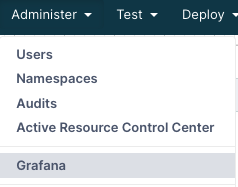
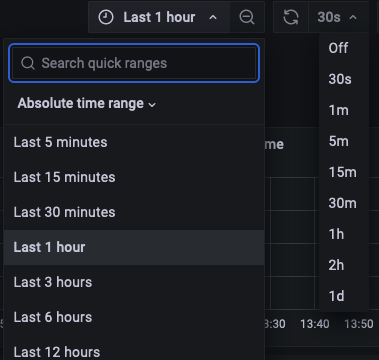
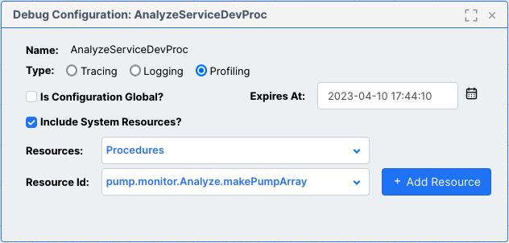
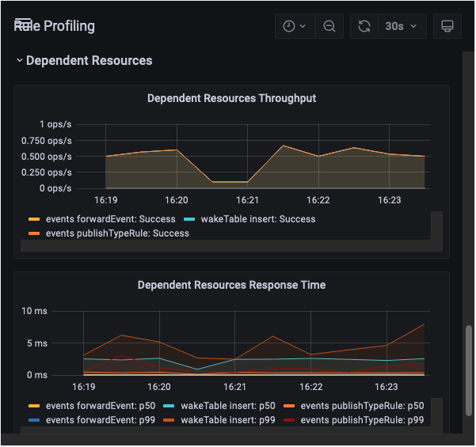
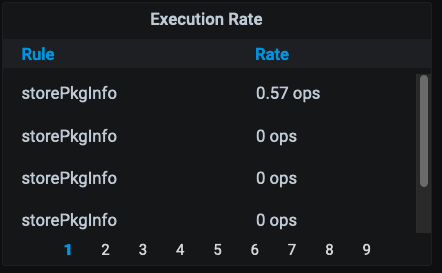
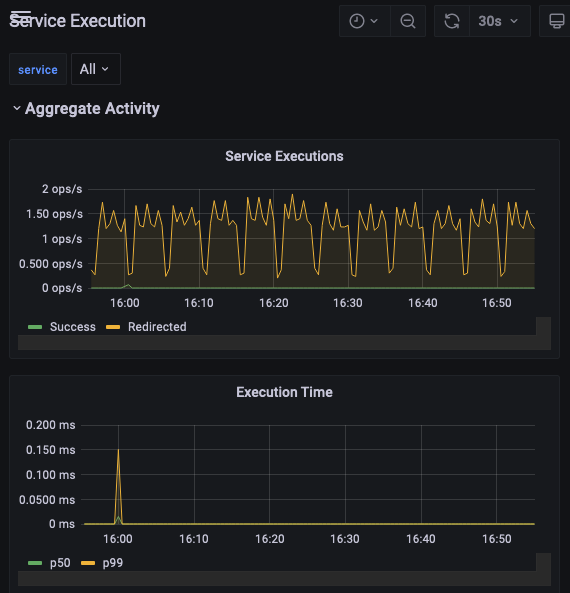
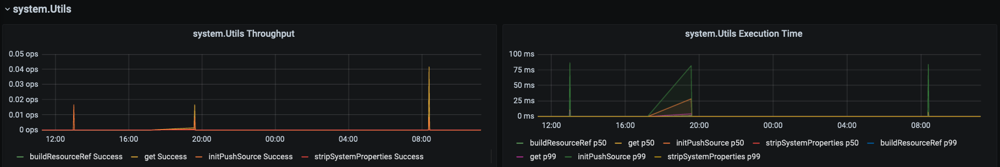

# Monitoring Namespaces with Grafana

This guide describes how developers can use Grafana to monitor resource usage and server performance of their projects.

## Conceptual Overview
The Vantiq cloud-based platform features several tools to make run-time application activity transparent to developers, from the Design and Development through to Operations and Maintenance phases of the software development life cycle.  One of these tools is a 3rd-party browser-based server performance monitoring service called [Grafana](https://grafana.com "Grafana"). Developers and administrators access Grafana dashboards to observe in real-time how their applications are performing under load.

A specific configuration of Grafana is embedded into the Vantiq platform for each scope of Vantiq user:
* **Developers** view Grafana dashboards for namespace metrics
* **Organization Administrators** access Grafana charts and statistics across all namespaces in the Organization
* **System Administrators** see Grafana charts and statistics across all organizations

This guide will focus on Namespace-level Grafana metrics for Project Developers.  Grafana offers different features and dashboards for each scope, but knowing how to use Grafana to observe resources usage and performance within a single Vantiq Namespace is foundational to understanding the Organization and Installation system scopes.

Within the Vantiq Platform, system metrics and monitoring capabilities work through the interaction of several functional components:

A clustered event bus traverses server entities, under load from application systems, feeding metrics from them to a monitoring time-series database.  Grafana's graphical dashboards and statistics are visual representations of pre-configured query results against this database, accessible to an application developer from the IDE.

## Grafana Usage
Developers primarily use Grafana to:
* Discover consequential performance bottlenecks in their application systems
* Plan capacity during development, testing and ongoing operations
* Confirm the continued smooth operation of deployed applications

Grafana brings to light the largest impacts on scalability and latency including:
* Database DML statements
* Inbound and Outbound event rates
* Computational costs (related to message size and content)
* Internal processing delays

**_Note_**: Grafana is only available for clustered installations - Vantiq public and private clouds.  It is not supported on Edge servers.

## Getting Started with Grafana
To access Grafana, select the  **Administer** menu tab at the top of the Vantiq IDE, and choose **Grafana**:

The Grafana window will open as a pane in the IDE.  It might look like this:

  

Or it might look slightly different, especially if the pane is resized:  

The Dashboards available from this Grafana pane are pre-configured with queries to display resource information tailored to the current Vantiq namespace.  To see them, click the menu to manage them:

A list of available dashboards appears under the **General** folder icon.

## Grafana Monitoring Dashboards for Project Developers

### Dashboard Panel Controls

Clicking on any option in the list of dashboards will bring up a new pane with a GUI display of the relevant area of interest.  Most of the dashboards have similar viewing options at the top of the pane:

Clicking the star will make this dashboard part of a "Favorites" list.  The "Share" icon is very useful for viewing the dashboard in a separate browser window, and giving others access to it via the URL:

The monitor icon toggles between the standard and "kiosk" viewing modes.  (Press Esc to return to the original view mode.) Clicking on the clock icon next to it allows the developer to select or customize the time window over which the information will display. 

The magnifying glass icon widens the time window of the display, for a "zoom out" effect.  Within a chart, dragging the mouse across an area of interest on the graph itself will "zoom in" to that time window. This action will also pause information updates.  To resume updates, or select how often they will occur, choose the drop-down menu at the top right of the pane and choose the new timeframe desired.

The title bars for each panel, when clicked, provide a dropdown to expand the view, share the view in another browser window, perform deeper inspection (including downloading it to Excel) or toggle the panel legend on or off.

Another interactive feature in each dashboard allows the user to hover the mouse over the chart to see specific measurements for that moment in time.

## Namespace Monitoring Dashboards

The following are Grafana dashboards available for the scope of a single namespace:

* [App Execution](#app-execution-dashboard) - Metrics on event processing through Apps, including Activity Task granularity
* [App Profiling](#profiling_dashboards) - Threaded, additional metrics available when "profiling" has been enabled for a given App
* [App With Split Execution](#app-with-split-execution-dashboard) - App Execution Dashboard, with the addition of data for SplitByGroup Activity Tasks
* [Event Processing](#event-processing-dashboard) - Event flow by source, topic and type throughout the system
* [Procedure Execution](#procedure-and-rule-execution-dashboards) - Execution times and event throughputs of developer procedures
* [Procedure Profiling](#profiling_dashboards) - Threaded, additional metrics available when "profiling" has been enabled for a given Procedure
* [Resource Usage](#resource-usage-dashboard) - API activity affecting both developer and system types in the system
* [Resource Usage Profiling](#profiling_dashboards) - Threaded, additional metrics available when "profiling" has been enabled for resource usage
* [Rule Execution](#procedure-and-rule-execution-dashboards) - Execution times and event throughputs of developer rules and rules within developer-created collaborations
* [Rule Profiling](#profiling_dashboards) - Threaded, additional metrics available when "profiling" has been enabled for a given Rule
* [Service Execution](#service-execution-dashboard) - Executions times and event throughputs of both developer and system service procedures
* [Source Activity](#source-activity-dashboard) - Throughput and response time of sources used by the system, excluding MOCK sources
* [TensorFlow Model Execution](#tensorflow-model-execution-dashboard) - Execution times and event throughputs of developer tensorflow models
* [Type Storage](#type-storage-dashboard) - Database usage by developer-created standard types

### _Most Commonly Used Dashboards_

By using the Grafana dashboards available, developers will gain insights into the most minute details of their application function. More commonly, however, only a few of these panels provide the most benefit in locating the largest performance bottlenecks:

* [App Execution](#app-execution-dashboard) - Most applications employ Service Visual Event Handlers, or standalone Apps. Grafana displays which Activity Tasks could introduce scalability issues through unbounded latencies. 
* [Service Execution](#service-execution-dashboard) - Displays response time latencies for procedures defined in a Service's API
* [Event Processing](#event-processing-dashboard) - Provides confirmation that event rates are as expected, ensure that there are no events "dropping."
* [Resource Usage Profiling](#profiling_dashboards) - Here is where developers can discover unexpected database activity by watching what happens to every part of the running application, including system resources.
* [Source Activity](#source-activity-dashboard) - Even though inbound events are usually processed by Apps and therefore the App Execution dashboard will show most of the same information, Source Activity elucidates Source event throughput latencies.

### App Execution Dashboard

The App Execution Dashboard visualizes event activity in Apps within the Namespace, expressed in operations per second. 

Here is some of the critical App behavior to observe in this dashboard:
* Executions must match the volume of work expected for a given workload
* Ensure that execution times remain stable as loads change
* Observe Apps individually to detect potential bottlenecks

As a general rule of thumb, for high-volume systems, response times should remain under 1000 ms.  Also, if execution times grow disproportionally higher as the load increases, it is a scalability problem.  Using this dashboard, developers can identify the individual Apps and the Activity Tasks within them that are taking the longest to process.

Two panels for **Aggregate Activity** display the sum total of executions for all Apps; the first expressed in operations per second, and the second as a function of the total execution time.  At the bottom, the green line **p50** is the line for median execution time, and **p99** is the time overall. The aggregate information is useful to verify that there are no problems, but if there is, looking at Apps individually will pinpoint the one(s) where there is an issue.

Below the Aggregate Activity display panel, click the symbol next to **Maximum Values** to reveal the highest throughput rate levels, expressed in operations per second, of each of the Activity Tasks listed for each of the Apps running in the namespace.   

The App-specific charts below the Aggregate information display a graph of activity task throughput, with each line representing starting and success rates of each.  Here, we've achieved a "close-up" of part of this graph by clicking on the chart and dragging across the region of interest.   

To view just one part of the chart, click on its key listing below the chart, like "Collect Success", and just that information will display.  (Click the key listing again to restore the full view.)  

Note that the scale along the y axis may change - in this case, the range was from 0 to 300 operations per second when all of the tasks were displayed together, but by choosing to view just the "Collect Success" line, the range dropped to 0 to 150 ops.  This is helpful for making the display more readable for relatively low-operation tasks.

The **Task Execution Time** line chart shows the median and overall execution times by activity task for the App.  

In the example below, we see that the JoinStreams activity task in this App takes the most time to execute.  However, Joins have a parameter for developers to configure a "withinDuration" timeframe for the Join to connect parent events into the join, which can explain the longer execution time.  

With the App Execution dashboard, developers can investigate the throughput performance of the App by each of its Tasks, and as a whole.

### Profiling Dashboards

Grafana offers Profiling Dashboards for the following resources:
* App
* Procedure
* Rule
* Resource Usage, as defined by REST/HTTP calls

By default, Profiling is not enabled for any of these resources, so no data will appear in the dashboards.  By enabling profiling, the developer directs the Vantiq server to  collect additional statistics that aren't normally available, and these are threaded so the data shown is solely related to the "root" profiled resource.  

#### **_Enabling Profiling for Resources_**

To enable profiling for a resource, choose **Debug Configurations** from **Test -> Advanced** at the top of the IDE, and then click the New button in the Debug Configurations window.  The resulting pane allows the developer to choose a resource, with or without related System Resources, to be profiled for a specified length of time.

If **Is Configuration Global?** is checked, then all applicable resources will have profiling enabled for them.  Otherwise, developers choose first which type of resource to use in profiling, and then click the **+ Add Resource** to confirm the selection.

By default, Profiling will only remain enabled for two hours; the developer can modify this in the **Expires At:** text field.

**_Note_**: The **Administer -> Advanced -> Profiles** menu option is for configuring _user_ profiles, not specifying debug configurations, including resource profiling.

For resources where several of the same type have profiling turned on, such as when a user checked the **Is Configuration Global?** option in the Debug Configuration pane, a drop-down menu provides a list from which to choose.

The profiled resources share the same types of panels. The top two are **Throughput** and **Execution Time** graphs, which show much the same data as in the resource Execution Dashboards, such as in this example from an App Profiling dashboard.

 Below these are panels with more extensive information from the enabled profiling.

The **Event Delivery Latency** graph helps developers pinpoint time delays between event processes.  

The panels below this show throughputs and response times for dependent resources, first for any procedures processing, and then for other resources, as seen in this example, where a triggered rule results in an Insert operation on a persistent standard type.

The final couplet of panels are for the **DependentDB** involved, in this case, because of the Rule.

### App With Split Execution Dashboard

The App With Split Execution Dashboard includes the same query panels available in the [App Execution Dashboard](#app-execution-dashboard), plus more for SplitByGroup activity tasks within the Apps.

The panel for Aggregate Executions includes a separate line for Redirected Executions, which will not be visible unless one or more Apps in the namespace is using a SplitByGroup activity task.

There is an aggregated panel showing collective redirect latencies for all Apps' SplitByGroup activities.  The developer can also see the Split Rates and Redirect Latencies for each individual App.  Apps that do not use a SplitByGroup task will show no data.  In this example, the app has a SplitByGroup activity task called "SplitById;" rates and median/total redirect latencies are displayed for it.

### Event Processing Dashboard

Events are at the heart of Vantiq platform applications, so it's not surprising that Event Processing Dashboard is replete with event-related information touching all parts of the system.

Aggregate Activity shows all event arrivals into the system by kind.  From this panel, a developer can learn a lot about incoming messages, including:
* The average arrival load - does it meet expected rates?
* Commonality and severity of event "bursts"
* Event droppage 

Dropped events are lost events.  Developers must never ignore them, but drops associated with diagnostic data are not as concerning.  These would include events associated with rule or procedure snapshots, audit records, profiling events; all of which will not occur in the live application with diagnostic and debugging turned off.

Event drops associated with system operation are much more critical because it means that the application is not receiving and processing expected events.  Generally, these happen because the rate of event consumption is slower than event generation.  By inspecting the Event Processing Dashboard, the developer can determine if:
* Events are generated at too high a rate for the system
* Events are processed by the system at too slow a rate - this would appear as latencies that grow exponentially when the event rate grows

Solutions include:
* Slowing event generation
* Making the event handler more efficient
* Sending some processing to be done asynchronously by another event handler
* Avoiding database interactions where possible, as this is always a synchronous operation; using service state is much more performant

In the screenshot below, none of the events coming from audits, sources, topics or types are creating a high enough load to force the system to drop events, and yet there are drops shown by the line with the legend "collaborationtypes."  Further investigation reveals that there is a compilation error in a service procedure, which is preventing events from being processed.

Developers considering system scalability will want to pay close attention to this dashboard.  Heavy incoming event loads or frequent high event bursts might benefit from distributing the system to increase parallel processing.

Developers can expand the relevant sections to see more detail about events originating from:
* [audits](./resourceguide/index.html#audits) - occurs when an audit record for a non-type resource is generated
* collaborationtypes - these are Apps, aka Service Visual Event Handlers
* sources
* topics 
* types - both user-defined and system

Looking again at the Aggregate Activity Event Processing pane above, we see the orange line for "types" in the arrivals graph, but the project isn't interacting with database data, so what is that?  Scrolling down and opening the pane for "types" reveals that the type causing these events is "ArsRuleSnapshot," which is a system type, specifically one that persists error information, in this case caused by the procedure compilation error from before.

### Procedure and Rule Execution Dashboards

The Dashboards for Rule Execution and Procedure Execution provide metrics for rules and procedures respectively, including system rules and developer-written procedures, but not Service-generated procedures.  For the most part, developers should avoid creating rules in favor of handling events with Apps, aka Visual Event Handlers (from Services), as the activity tasks are already designed to be performant. 

Procedures are generally executed synchronously; developers should be looking in this dashboard to ensure that procedure execution latencies are low.

If procedure latencies are unacceptably high, consider:
* Invoking the procedure less often
* Determining if the procedure can be implemented more efficiently
* Moving some of the procedure's processing to another asynchronous event handler

At the top of the dashboard, the Aggregate Activity is displayed, by executions per second in the first panel and execution times in the other.  The **p50** line shows the median execution time, and the **p99** is the overall execution time.

The **Maximum Values** keep statistics on the highest measurements encountered by the procedure or rule in the timeframe specified, for
* Start Rate
* Execution Rate
* Execution Time
* Dropped Event Rate
* Failure Rate

Here is an example of the maximum executions rates kept for intervals of 30 seconds.  Past history is clickable from the page numbers below.

Below the Maximum Values panels are the variable list of application procedures or rules present in the namespace.  Expand the panels for any of these to see data for that rule or procedure individually.

In this example, the name of the procedure is "deluge," and the panels for deluge show throughput and execution time data as shown.

 

**_Note:_** Service procedures are not visible in these panels, but are visible in the [Service Execution Dashboard](#service-execution-dashboard).

### Resource Usage Dashboard

The Resource Usage Dashboard displays system API operations between resources on the Vantiq platform for a running application.  Generally, developers will be interested in this dashboard with respect to database interactions with resources:
* How many database requests come from the system as a whole, both from the running application and the Vantiq system infrastructure
* The volume of data requested

This is because databases have limited throughput, and therefore are the most frequent cause of performance issues. Developers should work to reduce database requests as much as possible.

Developers can choose which API view they want to see, depending on what is most relevant to the application.  Options available to the developer vary by what the project contains, but will include at least:

* REST - HTTPS REST methods
* VAIL - VAIL interactions with resources

Aggregate panels show the throughput and response time for all resources in the namespace.  Below these panels are expandable panels for individual resources.

REST API interactions are HTTP methods made against resources.

The affected resources can be expanded to see specifically the throughput and response times for REST calls used on them.

The SQL-like VAIL DML resource usage maps to REST calls. Here is an aggregate VAIL view showing the VAIL commands **insert** and **select**, which are mapping to REST methods PUT and GET respectively.

Below the aggregate panels is the Maximum Values option.  Expand it to see all the highest quantities of operations experienced by the system for each time interval in the current timeframe.

After the Maximum Values, there appears customized list of all the components that make up the whole of the namespace activity in particular.  Developers can delve deeper into the parts by expanding their corresponding panels. 

Here we see a VAIL view of the numbers and speed of select statements to the Sensors datatype in an application, expressed in operations per second.

The Resource Usage Grafana view is helpful for developers who want to see if there are any unexpected database interactions taking place in the system.  One of the panes available to show greater detail is "types," which details what database interactions are taking place:

In this example, we see that there are very few database interactions, and most of those are reads.  Since the App in this case enriches sensor input with database information, this is expected behavior.

### Service Execution Dashboard

The Service Execution Dashboard works much like the [Procedure and Rule Execution Dashboards](#procedure-and-rule-execution-dashboards) because all are monitoring the processing of VAIL code in different forms.  

[Services](./rules/index.html#services) encapsulate behavior associated with a specific functional aspect of an application. The Service interface consists of a list of procedures and/or Event Types. Services also manage their own State.  

The information seen for Service Executions are for the Service Procedure, and for both developer-created and system services.

**_Note:_** The initializer procedures for those services are not included in the output for the Service Execution dashboard.

In this initial view of the Service Execution dashboard for this namespace, two developer-created Services, PDC and Tests, are visible.  The rest of the Services are defined by the Vantiq system and engaged in some way with this running application.  Vantiq includes them here so they can be expanded for more in-depth analysis of how they are running in the system.

Let's say we're curious about which procedures were executed from the system.Utils service.

From this chart, we see entries for the following procedures in the system.Utils service executed within the running application within the last 24 hours:
* buildResourceRef
* get
* initPushSource
* stripSystemProperties

### Source Activity Dashboard

The Source Activity Dashboard monitors sources from standard industry messaging protocols and push notifications.  

**_Note:_** MOCK sources, artificial events generated by the **createSourceEvent()** VAIL procedure, SMS and REMOTE sources won't display here.

Developers using this dashboard are usually looking for dropped events from sources, and their cause(s).  Dropped events are lost events, and this is a problem.  Either too many events are coming into the system at once, or the processing latencies are too long.  Even before the system starts to drop events, processing latencies longer than the rate on event input are an early warning that eventually, the message queue will be exhausted and drops will occur.

By inspecting the Source Activity Dashboard, the developer can determine if:
* Events are generated at too high a rate for the system
* Events are processed by the system at too slow a rate - this would appear as latencies that grow exponentially when the event rate grows

Solutions include:
* Slowing event generation
* Making the event handler more efficient
* Sending some processing to be done asynchronously by another event handler
* Avoiding database interactions where possible, as this is always a synchronous operation; using service state is much more performant

In our example below, see two MQTT sources established by the developer: RPMSMQTT and TempMQTT.  The event rate, drops, and other statistics display for each source.  This is useful for developers who need to know more about the load and balance of source messages flowing into the system.

Much of this information is also displayed in the App Execution dashboard if incoming events are ingested by an App.  The Event Processing dashboard also displays Sources as one line in the aggregate graph, with a separate pane for sources below.

Expanding the panels for RPMSMQTT reveals the throughput rate, including messages received and dropped.  A second panel is for Operation Response Time.

### Tensorflow Model Execution Dashboard

As the name suggests, the Tensorflow Model Execution Dashboard displays performance data and resource usage Tensorflow models running in the namespace.

In keeping with the norm of the other dashboards, users can opt to see either aggregate execution and time activity for all tensorflow models, or single out a few or just one, from the **model** dropdown list.

### Type Storage Dashboard

The Type Storage dashboard displays disk usage for developer-defined standard data types in the project.  The information is up-to-date and not based on what has occurred in the selected time frame, though developers might have to choose a time window longer than the default in order for the data to appear.

As a general rule, developers should have a model of the application and all the resources it is expected to use.  Use this dashboard as a "sanity check" to ensure that the system is utilizing the expected amount of storage.  If there is a substantial divergence, investigate whether or not the model is flawed, or if the system isn't implemented properly.

